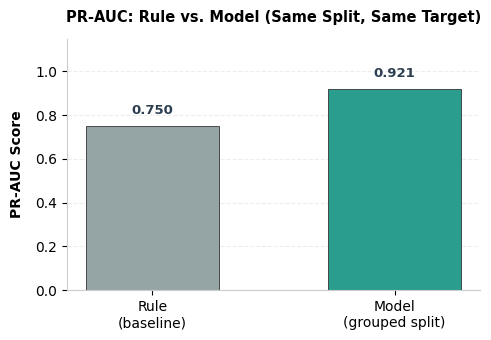
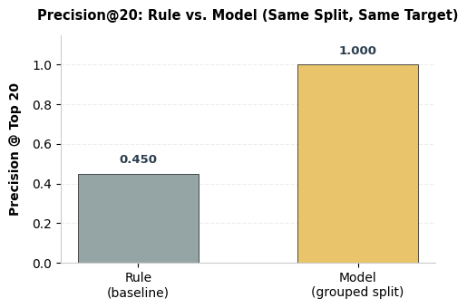
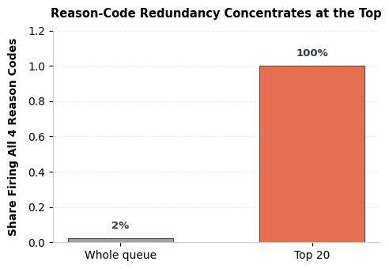

# Refresh / Content Opportunity Scoring
### Prioritizing which content to review first, from 78.8M rows of production search performance data

**Author:** Syed Zohaib Ali Naqvi
**Lane:** Refresh / Content Opportunity Scoring
**Repo:** [github.com/Szan-12345/FLYRANK-MACHINE-LEARNING](https://github.com/Szan-12345/FLYRANK-MACHINE-LEARNING)
**Date:** August 11, 2026

---

## Abstract

This project asks which of a client's content items a search team should review first, when review capacity is limited and most items can't be checked by hand. Using 78.8 million rows of production Search Console performance data from the FlyRank ML Internship warehouse, spanning 46 clients, it compares a transparent rule-based scoring formula against a Logistic Regression model trained on the same client-grouped, decision-day-anchored windows. On this run's held-out test set the model beat the rule on every metric measured (PR-AUC 0.750 → 0.921, precision@20 0.450 → 1.000) — but an earlier run of the identical pipeline found precision@20 moving the opposite direction instead (0.60 → 0.35), making the central finding of this paper that its own results shift with which snapshot of a live, growing warehouse they're measured on, not a single fixed verdict. The output is a blended, reason-coded action queue — not an automated decision — meant to help a human reviewer decide where to look first, with explicit limits on what it can and can't claim about causation, generalization, or content quality.

---

## Table of Contents

1. [Introduction / Problem Statement](#1-introduction--problem-statement)
2. [Data](#2-data)
3. [Methodology](#3-methodology)
4. [Results](#4-results-vs-baseline)
5. [Limitations & Honest Framing](#5-limitations--honest-framing)
6. [Ranked Recommendations](#6-ranked-recommendations--the-action-playbook)
7. [Reproducibility](#7-reproducibility)
8. [Acknowledgments & Data Credit](#8-acknowledgments--data-credit)

---

## 1. Introduction / Problem Statement

**Decision this supports:** Each review cycle, a content team has capacity to manually check only a fraction of a client's inventory. This project decides *which content items get that limited attention first*.

**Unit of analysis:** One content item's search performance for one client over a 15-day window (`client_hash_id` + `content_hash_id`, aggregated from daily rows in `fact_content_daily_performance`) — not a single day, and not the page in the abstract. Scored against 99,893 such content-item windows in the working slice, drawn from a 78.8-million-row production table.

**Output:** A ranked action queue — not a bare yes/no. Each flagged item carries an `action_score` (the primary, transparent rule-based signal), a `model_score` (a secondary confidence check), and reason codes (`IMPR_DROP`, `CLICK_DROP`, `POSITION_SLIP`, `ACTIVITY_DROP`) explaining *why* it was flagged.

**Action a human takes:** A content strategist opens a flagged item, reads its reason codes, and picks a specific move — rewrite, expand a thin section, update a stale fact, fix a technical issue, or leave it alone. The system doesn't choose the fix; it chooses where to look first.

**Cost of a wrong call:**
- *False positive* — a flagged item that wasn't really worth it — burns a reviewer's fixed, limited hours on the wrong page.
- *False negative* — a real decline that never gets flagged — keeps eroding silently and compounds the longer it's missed.

Both costs are about the *ordering* of the queue, not a single accuracy number — which is why the project is evaluated on precision-at-K / PR-AUC rather than raw accuracy, and why "scoring," not plain classification, is the right frame.

**Why data/ML helps instead of a fixed rule:** Two things ruled out an if-statement early. First, the obvious heuristic — "old content is what's declining" — doesn't hold: content age doesn't cleanly separate declining items from stable or growing ones. Second, single-threshold rules create both blind spots and ties: items just under a cutoff get ignored outright, and large blocks of items sharing one value can't be told apart by that value alone. The production rule-based baseline itself surfaced a related failure once real data was used — it couldn't tell a 52-impression item from a 3,772-impression item, scoring both about the same ("scale blindness") — direct evidence that a single hand-tuned formula misses a signal a model picks up by combining several features at once.

---

## 2. Data

**Release:** FlyRank ML Internship dataset (`FlyRank/internship-warehouse` on Hugging Face) — queried directly via DuckDB rather than downloaded in bulk.

**Tables touched, and how each was used:**

| Table | Size | Role |
|---|---|---|
| `fact_content_daily_performance` | 78,835,655 rows | Primary source — every feature and every label in this project is derived from it |
| `dim_clients` | 104 rows | Reference only — used to check per-client data-history spread, never joined into the feature or label pipeline |
| `dim_content` | 519,606 rows | Reference only — not joined into scoring; content items are addressed by hashed ID |
| `fact_content_daily_performance_sample` | 11,694,072 rows | **Not used.** A separate, sealed sample (June 2026) — deliberately left untouched as a potential future holdout |
| `fact_content_query_90d` | 2,414,248 rows | **Excluded entirely.** Its 90-day trailing window isn't confirmed aligned to any specific decision date, so joining it in risks a window-alignment leak |

**Date windows:** The scoring pipeline (baseline, model, and everything downstream) anchors to `decision_day` — the most recent date present in the release — and compares two **equal, adjacent 15-day windows** ending there: a "prior" window and a "last" window. Both windows are fully in the past relative to `decision_day` by construction, so there's no future-outcome leakage to guard against in this design; the leakage risk here is cross-client, not cross-time.

**Scope after filtering:** Items with fewer than 50 impressions in the prior window are dropped before scoring — a reliability floor (`MIN_PREV_IMPR = 50`), not a judgment call applied after the fact. That leaves **99,893 content items scored**, of which **78,630 carry at least one reason-code flag** and make up the working review queue. The stricter model target (`high_confidence_decline`) requires prior-window impressions ≥ 250 — five times the scoring floor — on top of a rule flag.

**What was excluded, and why (public-safe):**
- `fact_content_query_90d` — window-alignment risk, excluded at the table level.
- `client_hash_id` / `content_hash_id` — pseudonymous identifiers, used only to join and group; never used as a model feature.
- `report_date` — defines the window boundary only, not a model input.
- `gsc_data_available` — a filter flag, not a feature.
- The outcome-window impression total — never included as a feature. Including it on purpose, once, as a check, pushed AUC from an honest 0.590 to a leaky 1.000, confirming it as pure label leakage.
- No client names, URLs, or query text appear anywhere in this project — the warehouse is pre-hashed at the source, and every notebook confirms no ID or free-text field survives into `work/outputs/`.

**Data limits (disclosed, not corrected for):** Per-client history isn't uniform — `dim_clients` shows GSC start dates ranging from January 2025 to June 2026, so "the prior window" isn't equally deep in history for every client. Rows before a client's own data-start are zero-filled rather than representing verified zero engagement, and this project doesn't distinguish the two. Separately, only **36.7%** of rows in an exploratory slice had `gsc_data_available = TRUE` — a meaningful share of rows carry no usable Search Console signal.

---

## 3. Methodology

**Core assumption:** two adjacent, equal-length windows (prior 15 days vs. last 15 days, both ending at `decision_day`) are a fair basis for "getting worse" — but only once volume is high enough that a percentage swing means something. Below that floor, noise looks identical to decline. That's the reason `MIN_PREV_IMPR = 50` is a hard gate before any scoring happens, not a post-hoc filter.

A second, load-bearing assumption: content items belonging to the same client are *not* independent. A migration, a Core Update, or a CMS outage moves many of a client's items together — a pattern directly observed in Results, where two clients account for 70% of the top-20 flagged items.

**Baseline — the rule:** A transparent, weighted `action_score` built from four component scores, each clipped to [0, 1]: impression drop, click drop (CTR compression beyond the impression drop), position slip, and activity drop (fewer days with any impressions at all — the highest-urgency signal, since it can mean deindexing). Each component also emits its own reason code (`IMPR_DROP`, `CLICK_DROP`, `POSITION_SLIP`, `ACTIVITY_DROP`) so a flagged row always comes with *why*, not just a number.

**Label definition (model stage):** `high_confidence_decline` = 1 if the rule flagged the item (at least one reason code fired) **and** its prior-window impressions were comfortably clear of the reliability floor (≥ 250). This label is a direct encoding of the manual judgment call made during the baseline's top-20 review ("real volume behind this drop" vs. "near-floor noise"), turned into something trainable — not an independent ground truth.

**Features (5, Logistic Regression):** `pct_impr_change`, `pct_click_change`, `pos_change`, `activity_change`, and `log_imp_prev` — the last one added specifically to test the baseline's scale-blindness weak spot.

**Why Logistic Regression:** it stays a probability that re-ranks the existing queue rather than replacing it with a different paradigm, and its coefficients map one-to-one onto the same signals the reason codes already track — keeping the model readable rather than a black box.

**Validation design — grouped by `client_hash_id`, not by row.** A row-level split would let one item from a client sit in training while its sibling — exposed to the same shared event — sits in test, leaking the event across the split. `GroupShuffleSplit` on `client_hash_id` (seed 42) keeps every client entirely on one side. Not time-aware: both windows are already fully in the past relative to `decision_day`, so the risk here is cross-client, not cross-time. Test set (this run): 14,629 rows — this count moves run to run, because `decision_day` is defined as the most recent date in a live, growing warehouse (see Results).

**Leakage checks — three separate passes, confirmed twice:**
1. **The deliberate trap, checked at two different stages of the project.** Early on (Week 3, exploratory March-2026 slice, asymmetric 15-vs-16-day window): the outcome-window impression total was added as a feature on purpose, once, as a check. Honest AUC: 0.590. With that column included: 1.000 — a complete reconstruction of the label. Re-run later on the final pipeline (decision-day-anchored, equal windows): Honest AUC 0.885, Leaky AUC 0.911 — a real, measurable lift, but a smaller gap than the original check. Both runs point the same direction — including the outcome window inflates AUC — but the exact size of that inflation depends on which pipeline it's measured on, which is why both numbers are reported here rather than quoting only the more dramatic one.
2. **Scoring-frame check:** no outcome- or label-named column present in the scoring frame; no `fact_content_query_90d` column present.
3. **Full audit on the final feature set:** no feature is target-derived, no forward-looking columns exist, no ID column leaked in. Strongest correlation with the target is `log_imp_prev` at 0.452 — moderate, not suspiciously high. Confirming the split design matters mechanically, not just in theory: the same model under a row-level split showed 42 clients leaking across train/test; under the grouped split, 0.

This audit rules out the specific leakage patterns checked for — a directional finding, not a certification that no leakage of any kind exists.

---

## 4. Results (vs. Baseline)

**Head-to-head, same cleaned frame, same grouped split, same target — this run:**

| Metric | Rule (baseline) | Model (Logistic Regression) |
|---|---|---|
| PR-AUC | 0.750 | **0.921** |
| Precision@20 | 0.450 | **1.000** |
| Recall | 1.00 (by construction) | 0.780 |
| Accuracy | — | 0.808 |
| Precision (positive class) | — | 0.906 |

Base rate for `high_confidence_decline` on this run's cleaned population: **0.591** — close enough to 50% that neither metric above is being flattered by a rare-class effect. Test set: 14,629 rows.





**An important caveat: this result is not stable across runs, and that instability is itself the headline finding here.** An earlier run of this identical pipeline — same code, same seed, same target definition — measured a genuine trade-off instead: PR-AUC rose (0.759 → 0.893) but precision@20 *fell* (0.60 → 0.35), meaning the model's top picks were *less* reliable than the rule's. This run shows the model winning cleanly on both metrics. What changed between the two runs is `decision_day` itself — defined as `MAX(report_date)` in a warehouse that keeps growing. A later `decision_day` shifts which 99,893-item population gets scored, which client mix survives the reliability floor, and ultimately which numbers come out the other end.

This is reported as a finding, not smoothed over: **the head-to-head result is sensitive to which snapshot of the warehouse it's measured on**, and neither run's exact numbers — including the ones in the table above — should be read as a settled, permanent verdict. What holds across both runs: the model consistently matches or beats the rule on PR-AUC, and the grouped split is consistently the honest validation design. Precision@20 has flipped direction between runs and is the least stable number in this table.

**Error profile:** on this run's 14,629-row held-out test set, the model produced 757 false positives and 2,047 false negatives — a roughly 2.7:1 skew toward missed declines, a different balance than an earlier run's closer-to-even split. Treat this ratio as run-dependent, not a fixed property of the model.

**What the model actually leans on — coefficients vs. permutation importance still tell different stories:** by coefficient magnitude this run, `pct_impr_change` (−1.42) is dominant, with `log_imp_prev` (+0.89) close behind, `activity_change` (−0.86) and `pct_click_change` (−0.65) weaker, and `pos_change` effectively inert (0.0003) — note the top two coefficients have swapped rank from an earlier run, which had `activity_change` narrowly ahead of `pct_impr_change`. Permutation importance on held-out data tells a steadier story across both runs: `log_imp_prev` dominates what the model actually relies on (0.208), well ahead of `pct_impr_change` (0.059), `pct_click_change` (0.027), and `activity_change` (0.006). The feature added specifically to fix the baseline's scale blindness is consistently what the model leans on for correct predictions, even as its coefficient rank moves around.

**Robustness check — same model, two splits, this run:** Row-level split: PR-AUC 0.868, precision@20 0.900, with 42 clients leaking across train/test. Grouped split: PR-AUC 0.921, precision@20 1.000, with 0 clients leaking. The grouped split scored at or above the row-level split on both metrics — consistent with the direction seen in an earlier run, unlike the head-to-head comparison above, which did flip. The grouped split remains the methodologically correct choice regardless of any single run's exact numbers.

**Reason-code redundancy at the top of the queue, quantified:** 100% of this run's top 20 items fire all four reason codes at once, versus just 2% of the whole 47,332-item queue.



---

## 5. Limitations & Honest Framing

**The label is a judgment call, not ground truth.** `high_confidence_decline` is a proxy encoding what a human reviewer's gut-check already looked like — not a verified outcome like confirmed traffic recovery or a client-reported issue. Every result in this paper measures how well the model reproduces that specific judgment call on this specific data, not how well it predicts "real" decline in some independent sense.

**Results are not stable across warehouse snapshots — this is the paper's most important disclosed limitation.** Because `decision_day` is defined as the most recent date in a live, growing table, re-running this exact pipeline on different days produces meaningfully different numbers, not just noise in the third decimal place: one run showed a genuine precision@20 trade-off (0.60 → 0.35, the model losing ground at the very top of the queue), while another showed the model winning cleanly on precision@20 (0.450 → 1.000). Both runs agree the model matches or beats the rule on PR-AUC and that the grouped split is the honest validation design — but any single run's exact numbers, including the ones reported in this paper's Results table, should be read as a snapshot, not a permanent verdict.

**The volume fix's effect on the top of the queue is itself unstable.** `log_imp_prev` reliably fixes the baseline's scale blindness on PR-AUC across runs, but its effect on precision@20 specifically has gone both directions — a real trade-off in one run, a clean win in another (see the instability finding above).

**Client concentration can look like content decline when it's actually one event.** Two clients account for 70% of the baseline's top-20 flagged items. The current queue doesn't separate "many pages independently declining" from "one site-wide event producing many symptoms."

**Coverage gap for new clients, not a health signal.** A client with no prior-15-day history falls below `MIN_PREV_IMPR` by definition and doesn't appear in the queue at all. Absence means "not scored," never "healthy."

**Metric redundancy at the top of the queue.** The four reason codes consistently trigger together at the top of the queue because they're downstream symptoms of one shared traffic collapse, not four independent confirming checks.

**Data coverage is uneven and not corrected for.** Per-client GSC/GA4 history start dates range from January 2025 to June 2026. Rows before a client's own data-start are zero-filled rather than representing verified zero engagement, and only 36.7% of rows in an exploratory slice had usable GSC data at all.

**No causal claim, anywhere.** This project observes association between the feature window and the outcome window on historical data. It does not claim that reviewing, or acting on, a flagged item causes recovery — that would require an experiment this project doesn't run.

**No calibrated cost/value model behind the recommendations.** The playbook's review-ordering logic is a stated triage heuristic, not an ROI calculation — there's no revenue or traffic-value model behind it.

**Generalization is unconfirmed beyond this test set.** Results are measured on one client-grouped split of one snapshot of the warehouse — see the snapshot-instability limitation above for how much a single snapshot's numbers can move. The grouped split has scored at or above the row-level split on every run so far (0.921 vs. 0.868 on the run reported here), which is the defensible, stable finding — not any single run's exact metric values.

**Claims from FlyRank's own published research are cited as context, not verified here.** Two of the paper's headline findings raise open methodology questions this project didn't resolve: a refresh-effect claim may be affected by survivorship bias in which pages qualify for its comparison sample, and a published holdout-accuracy claim doesn't specify whether its train/test split was row-level or grouped by brand — the exact failure mode this project found and corrected for in its own model. Neither question is answered here; both are flagged as things a reader should hold loosely.

---

## 6. Ranked Recommendations — the Action Playbook

**Who this is for:** a content strategist or SEO reviewer doing weekly or monthly triage across a client portfolio — someone deciding which of hundreds of possibly-declining items to look at *first*, not someone looking for a final verdict on any single item.

**The queue, in one line:** every flagged item is ranked primarily by the rule's `action_score`, with the model's `model_score` shown alongside as a secondary confidence signal — not a replacement for the rule. This run's queue contains 47,332 flagged items.

**Recommended review order, ranked:**

1. **Any `ACTIVITY_DROP` item, regardless of overall rank.** The rarest and highest-urgency code — it can mean a page has technically broken or been deindexed. Fastest to resolve: a coverage check either confirms a fixable break or rules it out quickly.
2. **High `action_score` and high `model_confidence` agreeing.** Where the transparent rule and the model concur, that's the strongest evidence of a genuine, volume-backed decline.
3. **Everything else**, worked down the ranked list. Where the rule and model disagree sharply, treat that as a case needing a closer look — not an automatic tie-break either way.

**What a reviewer must check before acting on any item:**
- Rule out an already-known cause first — a migration, a seasonal category, a planned retirement.
- For `ACTIVITY_DROP` specifically, check indexing/coverage status directly — this may need a developer, not a content edit.
- Weigh `imp_prev` against the reliability floor — items just above threshold carry more noise; `model_confidence: low` items deserve more skepticism.
- Treat a strong rule/model disagreement as a flag to look closer, not a reason to default-trust one signal.

**What this playbook explicitly does not authorize — a no-go list:**
- **No auto-publishing or auto-editing.** The queue identifies review candidates; it has no signal about what a correct rewrite looks like.
- **No auto-unpublishing or deindexing.** A false positive here could pull down a page that was never actually failing.
- **Not an employee performance metric.** The score reflects a proxy target, not a validated measure of anyone's content quality or effort.
- **Not client-facing without review** — the reasoning is directional and decision-support only.

**Monitoring and retrain triggers:**
1. **Base-rate drift** — a sharp swing in `high_confidence_decline`'s rate (e.g. a portfolio-wide Core Update) means that period reflects one event, not steady-state content health.
2. **Feature distribution drift** — a new client type with very different traffic patterns may mean the model's coefficients stop transferring.
3. **Precision@20 tracked against real outcomes** — the concrete next step beyond this paper: have a reviewer mark, on a sample of past queue items, whether the flagged decline was real and actionable.
4. **Quarterly retrain cadence** as a starting point, with an out-of-cycle retrain triggered immediately by (1) or (2).
5. **Periodic review of the rule constants** (`MIN_PREV_IMPR`, the drop thresholds) — set once, not yet re-validated against fresh data.

---

## 7. Reproducibility

**Fresh-clone setup:**

```bash
git clone https://github.com/Szan-12345/FLYRANK-MACHINE-LEARNING.git
cd FLYRANK-MACHINE-LEARNING
pip install -r requirements.txt
```

Each notebook also self-installs its two extra dependencies at the top of the first cell (`%pip -q install duckdb huggingface_hub`), so they run standalone even outside the repo's environment.

**Credentials:** every notebook connects to the warehouse via a Hugging Face read token. Set it once, either as an environment variable (`HF_TOKEN`) or a Colab Secret named `HF_TOKEN`. No token is stored in any committed file.

**Run order:**

```
work/notebooks/w01_research_question.ipynb
work/notebooks/w02_ml_task_framing.ipynb
work/notebooks/w03_data_contract.ipynb
work/notebooks/w04_baseline_score.ipynb
work/notebooks/w05_model.ipynb
work/notebooks/w06_validation_audit.ipynb
work/notebooks/w07_action_playbook.ipynb
work/notebooks/capstone.ipynb
```

Each opens directly in Colab from the badge at the top of the file, or runs locally via `jupyter nbconvert --to notebook --execute <name>.ipynb`.

**Random seed:** `SEED = 42`, fixed once and reused everywhere it matters — `train_test_split` (the honest/leaky comparison), `GroupShuffleSplit` (the client-grouped splits), and `permutation_importance`'s repeat sampling. Same seed, same split, every re-run.

**Committed receipts — the numbers in this paper trace back to these files:**

| File | Produced by | Contains |
|---|---|---|
| `work/outputs/w03_contract_metrics.json` | w03 | honest AUC, leaky AUC, row count, declining rate, GSC availability % |
| `work/outputs/baseline_action_score.csv` | w04 | the full 78,630-row baseline queue |
| `work/outputs/w05_model_metrics.json` | w05 | historical — an earlier run's PR-AUC, precision@20, coefficients, permutation importances |
| `work/outputs/w07_action_playbook_queue.csv` | w07 | historical — an earlier run's blended queue |
| `work/outputs/w07_monitoring_snapshot.json` | w07 | base rate, scored/flagged counts, eligible-client count (46) at that run's time |
| `work/outputs/w07_playbook_summary.json` | w07 | historical — an earlier run's recommendation summary stats |
| `work/outputs/capstone_results_metrics.json` | capstone | **canonical source for this paper's Results table** — rule and model scored on one identical cleaned frame and split, replacing two earlier notebooks that used slightly different NaN-drop ordering |
| `work/outputs/capstone_ranked_queue.csv` | capstone | this run's final ranked queue — 47,332 flagged items with reason codes and recommended actions |

**No sealed or blind evaluation is claimed in this paper.** `fact_content_daily_performance_sample` (the separately sealed June 2026 slice) was deliberately left unqueried throughout this project — it wasn't used to produce any number reported above, and remains available as a genuine, untouched holdout for future work.

**Environment note:** package versions aren't pinned beyond what's in `requirements.txt` at the repo root — a `pip freeze` diff against that file is the fastest way to catch an environment mismatch if a re-run produces different numbers than reported here.

---

## 8. Acknowledgments & Data Credit

Built on the FlyRank ML Internship dataset — [flyrank.ai](https://flyrank.ai)

This project was made possible by production-scale search performance data provided through the FlyRank ML Internship program. All analysis in this paper uses hashed, pseudonymous client and content identifiers only; no client names, URLs, or private queries appear anywhere in this work.
